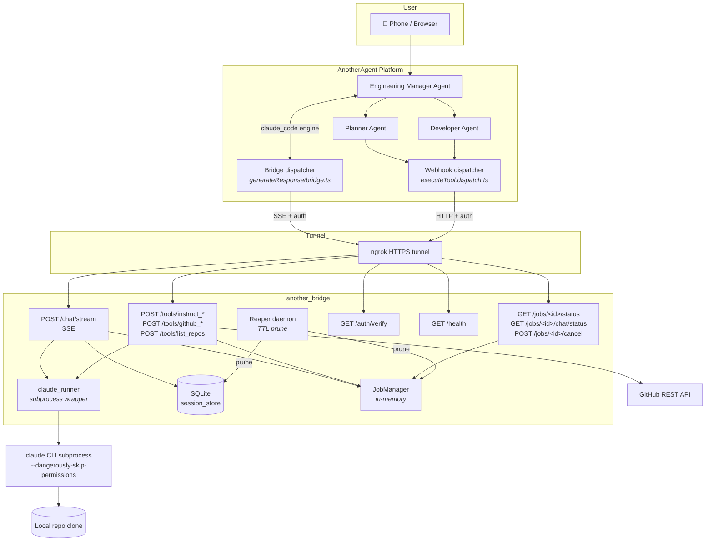
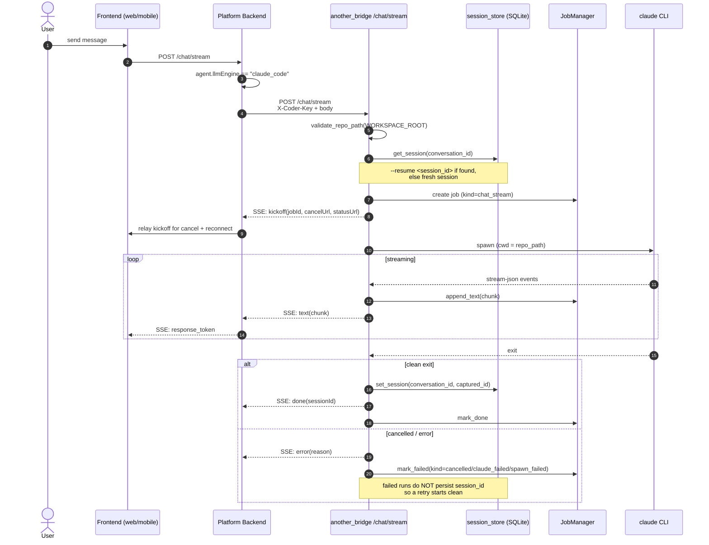
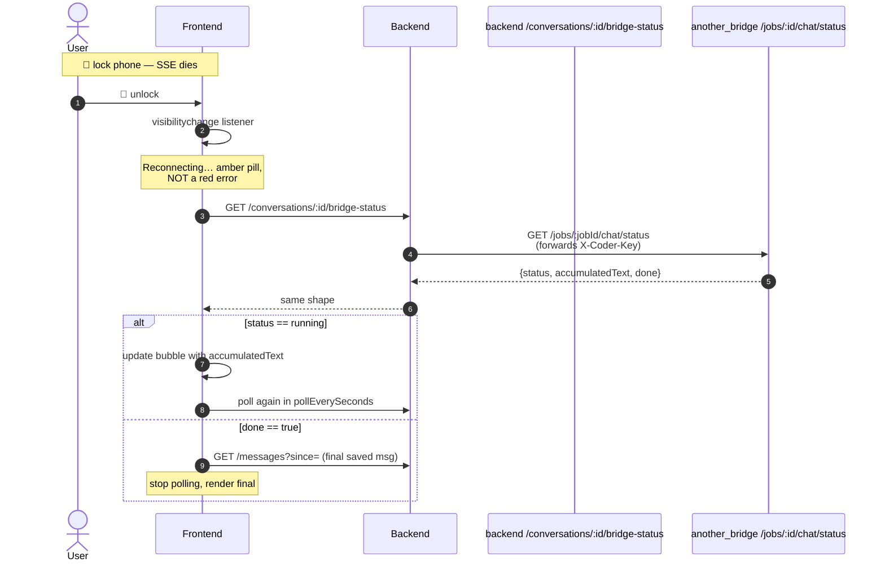
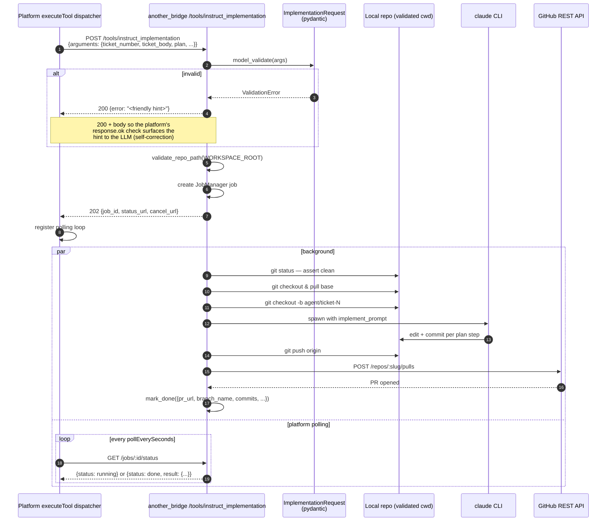
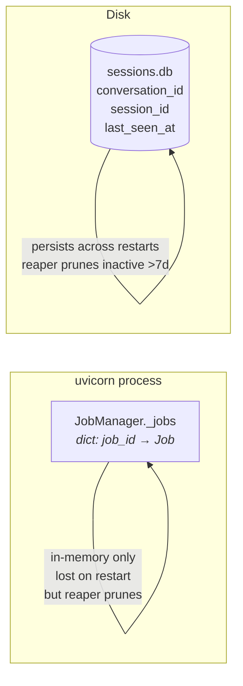
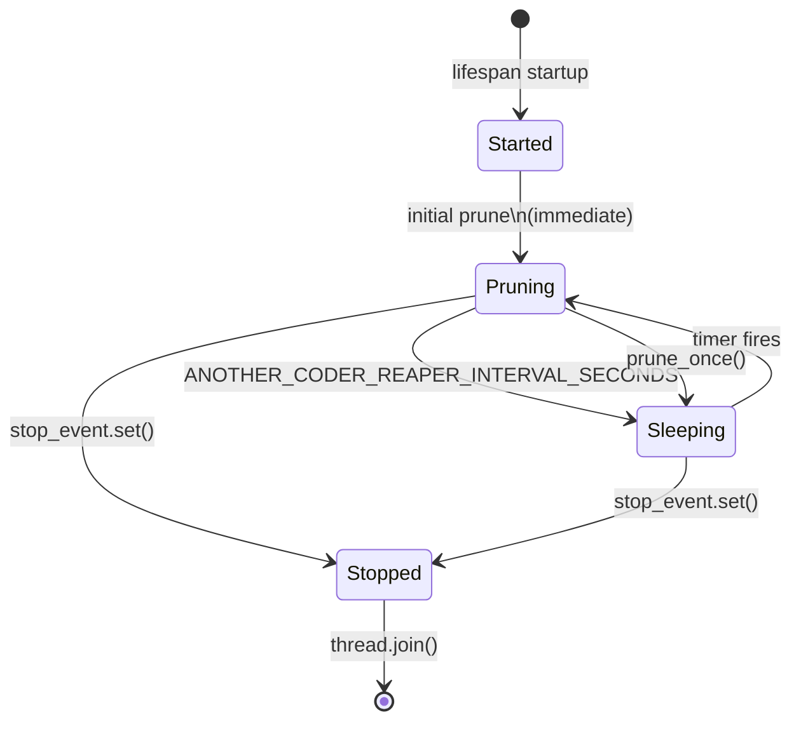
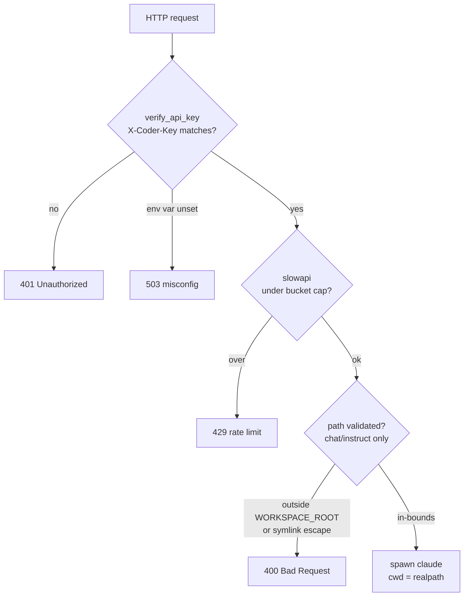

# Architecture

This document covers what `another_bridge` actually does at runtime: the
two main flows (claude_code engine bridge + webhook tools), the
polling-reconnect path, the persistence model, the lifecycle of the
TTL reaper, and the security model.

The bird's-eye view:



---

## 1. Bridge: `claude_code` engine via `/chat/stream`

The platform's `claude_code`-engine agents short-circuit their LLM
pipeline. Instead of invoking GPT/Claude through the platform's
provider, they POST to `/chat/stream` and stream the response back
to the user as if it had come from any other model.



**Key contracts:**
- Kickoff event is the FIRST SSE message, before any text. It carries `jobId`, `cancelUrl`, `statusUrl`, `pollEverySeconds`, `pollMaxSeconds` so the platform can register the cancel and polling primitives upfront.
- `set_session` runs **only** after a clean run. Failed/cancelled runs leave the prior `session_id` intact so the user's NEXT attempt can still resume the working state.
- `accumulated_text` is mirrored into the JobManager job alongside the SSE stream so the polling-reconnect path (next section) can read mid-flight progress.

### Mobile reconnect (SSE drop)

iOS Safari aggressively suspends background tabs. When a phone locks
mid-Claude-Code-response, the SSE socket dies and the platform's
frontend transitions to a polling reconnect:



The accumulator + polling endpoints are what make this seamless — the
user sees the partial text appear within a few seconds of unlocking,
instead of staring at a blank bubble until the graph-side `saveExchange`
lands and the next regular `/messages` poll picks it up.

---

## 2. Webhook tools: `/tools/instruct_planning` + `/tools/instruct_implementation`

The planning + implementation flow is
async-webhook. The platform fires a kickoff POST, gets a `job_id`
back immediately, then polls `/jobs/<id>/status` until done.



The same shape applies to `/tools/instruct_planning` minus the
git-branch-and-PR steps — it just runs Claude with the planning
prompt and returns the plan in `result.plan` plus an optional
`__summary__` and `__context__` for the platform's artifact system.

**Validation hint contract:** the platform's webhook dispatcher uses
`response.ok`. A `422 Unprocessable Entity` from FastAPI's default
handler would degrade to "webhook returned 422" in the LLM trace —
losing the recovery hint. So the schemas catch `ValidationError`
inside the route handler and return `200 OK` with `{"error":
"<actionable hint>"}` instead. The Planner Agent reads the hint
and self-corrects on its next pass.

**Failure surfacing:** every `mark_failed` call now includes a
structured `kind` (see `services/errors.py`):
- `spawn_failed` — `claude` binary missing.
- `timeout` — Claude exceeded the per-request `timeout_seconds`.
- `cancelled` — operator hit cancel.
- `claude_failed` — non-zero exit, stderr in `error`.
- `git_push_failed` — push rejected (auth, branch protection, network).
- `pr_create_failed` — GitHub PR API failure (422 enriched with diagnose+fix steps).

---

## 3. Persistence: SQLite session store + JobManager

Two layers, by design:



**Why split:**
- A `Job` is short-lived (minutes). Persisting it would buy us nothing
  — the platform polls actively for as long as the job runs, and
  once it's done the result has already flowed back. Dead jobs are
  pruned by the reaper.
- A `(conversation_id → session_id)` mapping is long-lived. The user
  expects to resume yesterday's chat into the same Claude Code
  session today, even after a `uvicorn` restart. SQLite is just
  enough — one row per conversation, two short strings, one
  timestamp.

**Schema:**
```sql
CREATE TABLE sessions (
    conversation_id TEXT PRIMARY KEY,
    session_id      TEXT NOT NULL,
    last_seen_at    INTEGER NOT NULL  -- unix epoch seconds
);
CREATE INDEX sessions_last_seen_at_idx ON sessions(last_seen_at);
```

WAL mode is enabled for crash safety. Single connection +
`threading.Lock` for serialized access (FastAPI's worker pool can hit
the store concurrently; SQLite connections aren't thread-safe by
default).

---

## 4. TTL reaper

A daemon thread spun up at app startup (FastAPI lifespan) and joined
on shutdown:



`prune_once()` does both prunes synchronously:
- `JobManager.prune_finished_older_than(ANOTHER_CODER_JOB_TTL_SECONDS)` — drops `done`/`failed` jobs whose `finished_at` is past the cutoff. **Running jobs are never touched** (cancel + status routes need them).
- `SessionStore.prune_older_than(ANOTHER_CODER_SESSION_TTL_SECONDS)` — drops session rows inactive past the cutoff.

Errors from either prune are logged and swallowed so a transient DB
lock or job-dict contention can't take the reaper down for the rest
of the process lifetime. The thread is daemonized — process exit
reaps it even if `stop()` somehow blocks.

---

## 5. Security model

Three layers:



**Layer 1 — auth.** Every route except `/health` runs through
`Depends(verify_api_key)`. `hmac.compare_digest` against
`ANOTHER_CODER_API_KEY` (constant-time). Empty env var returns 503
rather than allow-all — refuses to silently misconfig.

**Layer 2 — rate limiting.** `slowapi` keyed on hashed `X-Coder-Key`
(IP fallback for `/health`, but `/health` doesn't run the limiter).
Conservative defaults sized for a single-operator deployment;
tunable per surface via env. Bounds the leaked-key blast radius
before rotation.

**Layer 3 — path bounds.** Every Claude Code spawn includes
`--dangerously-skip-permissions`, so the spawn's `cwd` is the actual
security boundary. `validate_repo_path` resolves the path via
`os.path.realpath` (collapses `..`, follows symlinks) and refuses
anything not inside `WORKSPACE_ROOT`. Applied identically on
`/chat/stream`, `/tools/instruct_planning`, and
`/tools/instruct_implementation` — three pathways, one gate. When
`WORKSPACE_ROOT` is unset, falls back to a bare `isdir` check for
backward-compatibility — but that's strictly weaker, so production
deployments should always set it.

**What's intentionally NOT here:**
- **CORS middleware.** This is a server-to-server bridge consumed by
  the platform's backend, not a browser. A CORS policy would mislead
  about who's actually calling these routes.
- **Per-tool keys.** All routes share `ANOTHER_CODER_API_KEY`. The
  granularity buys little for a single-operator deployment;
  deferred until a real multi-user use case appears.

---

## 6. Module map

| Module | Responsibility |
|---|---|
| `main.py` | App construction, lifespan (reaper start/stop), middleware wiring, router registration. |
| `auth.py` | `verify_api_key` FastAPI Depends — header check + constant-time compare. |
| `config.py` | `Settings(BaseSettings)` from pydantic-settings + back-compat module-level constants. |
| `jobs.py` | `JobManager` + `Job` dataclass — in-memory job state, cancel + structured failure kinds. |
| `routers/auth.py` | `/auth/verify` probe endpoint. |
| `routers/chat.py` | `/chat/stream` SSE bridge to Claude Code. Repo-path validation, session resume, accumulator mirroring. |
| `routers/health.py` | `/health` (open). |
| `routers/jobs.py` | `/jobs/<id>/status`, `/jobs/<id>/chat/status`, `/jobs/<id>/cancel`. |
| `routers/repos.py` | `/tools/list_repos` + `validate_repo_path` (the workspace gate). |
| `routers/github.py` | `/tools/github_search_issues`, `/tools/github_get_issue`. |
| `routers/planning.py` | `/tools/instruct_planning` — webhook + background runner. |
| `routers/implementation.py` | `/tools/instruct_implementation` — webhook + background runner + git/GitHub orchestration. |
| `routers/_schemas.py` | `PlanningRequest`, `ImplementationRequest` pydantic models with the LLM-recovery hint contract. |
| `services/claude_runner.py` | Subprocess lifecycle for `claude` (run_blocking + streaming_subprocess). Reads `CLAUDE_BIN_PATH`. |
| `services/git_service.py` | `_run_git`, branch existence checks, default-branch detection, base-branch resolution, owner/repo regex. |
| `services/github_service.py` | GitHub REST API client (search_issues, get_issue, create_pr) + `format_pr_creation_error`. |
| `services/repo_context.py` | `build_selected_repo_context` for the `__context__` artifact emission. |
| `services/request.py` | `extract_args` envelope unwrap (`{arguments: {...}}` → `{...}`). |
| `services/errors.py` | Failure-kind constants used by `mark_failed` + status responses. |
| `services/session_store.py` | SQLite-backed `(conversation_id → session_id)` map. |
| `services/reaper.py` | Daemon thread that prunes JobManager + session store on a timer. |
| `services/rate_limiter.py` | slowapi `Limiter` instance + `_coder_key_or_remote` key function. |

---

## 7. Where to read next

- [`README.md`](../README.md) — setup + operator's how-to.
- [`docs/SECURITY.md`](SECURITY.md) — threat model, recommended deployment posture, key-rotation procedure. The "should I install this on my main laptop" doc.
- [`docs/CURL_EXAMPLES.md`](CURL_EXAMPLES.md) — raw cURL probes for every route.
